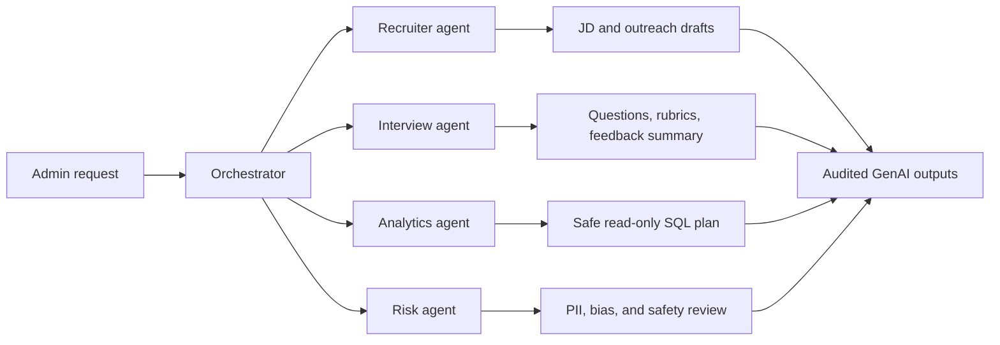

# TalentFlow AI GenAI System Design

## Product positioning

TalentFlow AI is now a GenAI recruitment intelligence platform. The project demonstrates how to combine transactional hiring workflows, lakehouse analytics, machine learning insights, and agentic GenAI workflows in one practical system.

## Agent architecture

## Agents

- Orchestrator: routes the user request, tracks the agent trace, and returns one final answer.
- Recruiter agent: drafts job descriptions and candidate outreach from structured job/candidate context.
- Interview agent: creates role-specific interview questions, rubrics, and feedback summaries.
- Analytics agent: maps natural language to guarded read-only SQL using the existing analytics assistant.
- Risk agent: checks for PII redaction, protected-attribute language, blocked fields, and unsafe analytics plans.

## GenAI engineering concepts shown

- Agent routing and orchestration.
- Tool use through deterministic domain functions and SQL planning.
- RAG-style grounding through database schema, learned examples, and structured candidate/job context.
- Memory through `analytics.agent_interactions`, `analytics.genai_copilot_outputs`, and `analytics.genai_agent_runs`.
- Guardrails through SQL sanitization, sensitive-column blocking, PII redaction, and human-review boundaries.
- Evaluations through offline tests that verify routing, redaction, SQL safety, and generated artifact contracts.

## Interview talking points

- I designed the system so GenAI augments recruiters and interviewers, but final hiring decisions remain human-owned.
- I used local deterministic generation for reliable demos and cost control, with optional Hugging Face/OpenAI paths for richer generation.
- I separated the agent layer from the Streamlit UI so the orchestration logic is testable.
- I stored prompts, traces, generated artifacts, and guardrail scores for auditability.
- I treated safety as part of the product architecture, not an afterthought.
