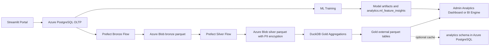

# TalentFlow AI

TalentFlow AI is an end-to-end recruitment data product. It combines a Streamlit hiring portal, Azure PostgreSQL source data, Azure Blob Storage medallion layers, Hive-compatible external tables, Prefect orchestration, DuckDB gold aggregations, and ML-based hiring insights.

## What The Project Demonstrates

- Candidate, interviewer, and admin hiring workflows.
- Azure PostgreSQL as the transactional recruitment database.
- Bronze, silver, and gold ELT architecture on Azure Blob Storage.
- PII protection in the silver layer using encrypted parquet outputs.
- SCD Type 2-style candidate history for changed candidate records.
- Gold analytics parquet tables for hiring funnel, salary benchmarks, engagement, city talent score, and hire rate.
- Hive-compatible external table definitions for bronze, silver, and gold lake layers.
- Runtime-based parquet versioning for bronze, silver, and gold outputs.
- ML models that publish feature importance into the analytics schema.
- Conversational analytics agent that can run in free local mode, generates safe SQL, runs it, explains results, shows charts, and learns from admin feedback.
- Multi-agent GenAI studio with recruiter, interview, analytics, and risk agents, including traces, guardrail scoring, output audit, and human-review boundaries.
- Validation checks for gold-layer table quality and reconciliation.

## Architecture



## Repository Layout

- `app/portal.py` - Streamlit portal for candidates, interviewers, and admins.
- `app/flask_api.py` - optional Flask API for safe analytics SQL planning, schema metadata, and GenAI hiring-pack generation.
- `app/analytics_agent.py` - schema-aware AI analytics agent with SQL safety checks, result narration, chart selection, and feedback memory.
- `app/local_sql_model.py` - free local semantic SQL model trained from built-in recruitment use cases and admin feedback.
- `app/analytics_assistant.py` - guarded conversational query layer for admin analytics questions.
- `app/genai_hiring_copilot.py` - local GenAI-style hiring copilot for recruiter artifacts, interview kits, feedback summaries, and safety guardrails.
- `app/genai_agent_orchestrator.py` - multi-agent router and orchestrator for recruiter, interview, analytics, and risk review workflows.
- `scripts/run_genai_evals.py` - lightweight GenAI evaluation checks for routing, redaction, and safe SQL behavior.
- `pipelines/` - Prefect ELT flows for bronze, silver, and gold layers.
- `lakehouse/hive_external_tables.sql` - Hive-compatible external table definitions over the parquet lake.
- `models/train_ml_insights.py` - ML training and feature-importance publishing.
- `scripts/validate_gold_analytics.py` - post-ELT analytics validation checks.
- `DDL.sql` - source database schema.
- `generate_production_data.py` - guarded demo-data generator.
- `tests/` - offline project contract tests.

## Setup

1. Create a virtual environment.
2. Install dependencies:

```powershell
pip install -r requirements.txt
```

3. Copy `config/.env.example` to `config/.env` and fill in values.
   For free local mode, set `LOCAL_AGENT_ONLY=true` and leave `OPENAI_API_KEY` blank or remove it. Add `OPENAI_API_KEY` only if you want optional cloud AI.
4. Deploy missing database tables, indexes, and safe column migrations. This does not reset existing data:

```powershell
python deploy_schema.py
```

5. Seed demo data only against a demo database:

```powershell
$env:ALLOW_DEMO_DATA_RESET="true"
python generate_production_data.py
```

## Run The Platform

Start the portal:

```powershell
streamlit run app/portal.py
```

Run the optional Flask API for integrations or backend demos:

```powershell
python app/flask_api.py
```

Local URL: `http://127.0.0.1:5000`

Useful endpoints:

```text
GET  /api/health
GET  /api/analytics/schema
POST /api/analytics/plan
POST /api/genai/hiring-pack
```

The Streamlit portal remains the main UI. Flask helps when you want the same guarded analytics and GenAI logic available to another frontend, a mobile app, Postman, automation scripts, or external services without screen-driving Streamlit.

Run the full ELT pipeline:

```powershell
python pipelines/run_elt.py
```

Run the ELT pipeline every 2 minutes for a live demo:

```powershell
python scripts/run_elt_scheduler.py --every-seconds 120 --publish-postgres
```

Use `Ctrl+C` to stop the scheduler. The scheduler writes a simple run log to
`logs/elt_scheduler.log`.

To show the 2-minute schedule directly inside Prefect Cloud, first log in and
select the workspace:

```powershell
prefect cloud login
```

Then serve the ELT flow as a Prefect deployment:

```powershell
python scripts/serve_elt_prefect_cloud.py
```

Keep that terminal open during the demo. In Prefect Cloud, open the selected
workspace, go to **Deployments** or **Flow Runs**, and look for
`TalentFlow-Full-ELT / talentflow-elt-every-2-min-demo`.

Each full run creates shared runtime partitions across the lake:

```text
bronze/<table_name>/run_datetime=YYYYMMDD_HHMMSS/*.parquet
silver/<table_name>/run_datetime=YYYYMMDD_HHMMSS/*.parquet
gold/<table_name>/run_datetime=YYYYMMDD_HHMMSS/*.parquet
```

The pipeline also maintains `latest/` copies under each table folder so downstream jobs can read the most recent version without knowing the run timestamp.

By default, the gold layer is lake-first: parquet gold tables are the analytical source of truth. If you also want to cache gold tables into PostgreSQL for the current Streamlit dashboard, run:

```powershell
python pipelines/run_elt.py --publish-postgres
```

To refresh the dashboard data and then automatically retrain/publish ML feature insights for the portal, run:

```powershell
python pipelines/run_elt.py --publish-postgres --train-ml-insights
```

Register the lake tables in a Hive-compatible metastore with:

```sql
-- Edit ${LAKE_ROOT} first.
-- Then run lakehouse/hive_external_tables.sql in your Hive/Spark/Synapse/Databricks SQL environment.
MSCK REPAIR TABLE talentflow_gold.job_hire_rate;
```

Validate gold analytics:

```powershell
python scripts/validate_gold_analytics.py
```

Train ML insights:

```powershell
python models/train_ml_insights.py
```

## Free Local Agent Mode

The conversational agent can run without OpenAI API billing using a local Hugging Face model. In `config/.env`, set:

```env
OPENAI_API_KEY=
LOCAL_LLM_PROVIDER=huggingface
LOCAL_HF_MODEL=Qwen/Qwen2.5-Coder-1.5B-Instruct
LOCAL_HF_DEVICE=-1
LOCAL_HF_MAX_NEW_TOKENS=600
```

Install the local LLM dependencies:

```powershell
pip install transformers torch accelerate langchain-core
```

LangChain is used in `app/huggingface_sql_agent.py` for prompt templating in the local text-to-SQL flow. The app passes schema context, learned examples, the user question, and repair context through LangChain `PromptTemplate` objects before sending the final prompt to the Hugging Face text-generation pipeline. This keeps prompt construction structured while preserving the existing local, no-cloud inference path.

The first run downloads the model from Hugging Face. After it is cached on the machine, inference runs locally. For stronger text-to-SQL quality on a capable machine, you can try a SQL-specialized model:

```env
LOCAL_HF_MODEL=defog/sqlcoder-7b-2
```

That model is much larger and may need significant RAM/VRAM. For a normal laptop CPU demo, the smaller Qwen coder model is usually more practical.

The project Streamlit config disables the file watcher because `transformers`
contains optional vision modules that may try to import `torchvision` during
Streamlit's module inspection. The TalentFlow agent uses text generation only,
so `torchvision` is not required.

If you need a no-download fallback, set:

```env
LOCAL_AGENT_ONLY=true
LOCAL_LLM_PROVIDER=
OPENAI_API_KEY=
```

In fallback mode, the agent uses a local semantic SQL model trained from recruitment analytics use cases and the feedback stored in `analytics.agent_interactions`. It can answer known and learned question patterns, execute the SQL, explain results, and show charts. When the agent misses a new type of question, paste corrected read-only SQL in **Teach the Agent** so it can reuse that pattern later.

For demo automation, include ML training after each scheduled ELT run:

```powershell
python scripts/run_elt_scheduler.py --every-seconds 120 --publish-postgres --train-ml-insights
```

Run offline tests:

```powershell
pytest
```

## Demo Flow

1. Show candidate registration and profile update.
2. Show admin scheduling an interview.
3. Show interviewer submitting feedback.
4. Run the ELT pipeline. Use `--publish-postgres` if the dashboard should read cached gold tables from PostgreSQL.
5. Run gold validation.
6. Train ML insights.
7. Return to the admin dashboard and show gold KPIs plus ML feature importance.
8. Open **GenAI Copilot** and run the **GenAI agent studio** to generate a role-specific hiring pack or a multi-agent request with trace, artifacts, guardrail score, and audit storage.
9. Open **Ask Data** and ask cross-system questions such as hiring summary, candidate engagement, interviewer workload, profile changes, or a custom read-only SQL query. The agent displays the generated SQL, executes it, explains the answer, shows the result table, and adds metrics or charts when the answer supports a visual.
10. Use **Teach the Agent** after an answer to mark it useful or provide corrected SQL. Useful/corrected examples are stored in `analytics.agent_interactions` and reused by the free local model and optional cloud agent for future questions.

For interview preparation focused on GenAI engineering, see `INTERVIEW_PREP_GENAI.md`.
For the deeper GenAI architecture narrative, see `GENAI_SYSTEM_DESIGN.md`.

## Production Readiness Roadmap

- Replace plaintext application passwords with hashed credentials.
- Move database migrations to Alembic.
- Add CI checks for tests, linting, and gold validation.
- Add role-based access control instead of email-domain checks.
- Add monitoring for Prefect flow failures, partition registration, and row-count drift.
- Add model cards and drift checks for ML outputs.


